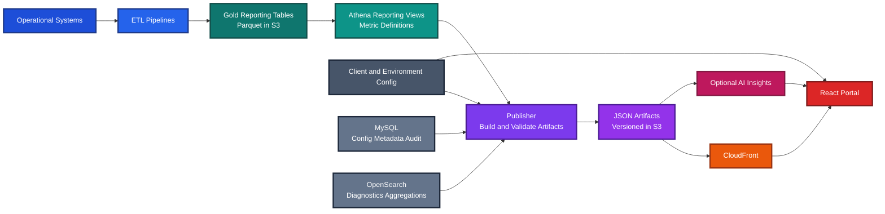

# Claude Code Guide — AWS Client Reporting Platform

## Purpose

This guide explains how to use Claude Code to safely build and maintain the AWS client reporting platform.

It translates the architecture into clear rules for:

- repository structure
- development workflow
- architecture boundaries
- multi‑client scaling
- CI/CD and operations

Claude accelerates development, but **humans define and protect the architecture**.

---

# Platform Overview

## Single‑Page Architecture Diagram



### Platform Flow

```
Operational Systems
 → ETL Pipelines
 → Gold Reporting Tables (Parquet)
 → Athena Reporting Views
 → Publisher
 → JSON Artifacts (S3)
 → CloudFront
 → React Portal
```

### Key Principles

- **Parquet + Athena are the reporting backbone**
- **Publisher generates deterministic artifacts**
- **JSON artifacts are the portal contract**
- **Portal is presentation‑only**

### Supporting Systems

- **MySQL** – configuration, metadata, and audit context
- **OpenSearch** – diagnostics and operational aggregations
- **AI (optional)** – insights and anomaly detection

### Design Goals

- support many clients
- support multiple environments
- deterministic reporting
- low operational cost
- cloud‑native scalability

---

# Repository Structure

```
repo-root/
  CLAUDE.md
  README.md

  docs/
    architecture.md
    json-contracts.md
    athena-views.md
    publisher-runbook.md
    portal-ui.md

  skills/
    build-publisher.md
    add-artifact.md
    update-athena-view.md
    build-react-panel.md
    investigate-failed-publish.md

  src/
    publisher/
    portal/
    shared/

  tests/

  .github/
    pull_request_template.md
    workflows/
      ci.yml
```

### Directory Roles

- **CLAUDE.md** – rules Claude must follow
- **docs/** – architecture and contracts
- **skills/** – reusable Claude task playbooks
- **src/** – application code
- **tests/** – validation and regression tests
- **.github/workflows/** – CI pipelines

---

# Recommended CLAUDE.md

```markdown
# CLAUDE.md

## Purpose
This repository implements a cloud‑native client reporting platform.

Architecture:
Operational Systems → ETL → Parquet Gold Tables → Athena Views → Publisher → JSON Artifacts → React Portal

## Architecture Rules
1. Athena defines reporting metrics.
2. Publisher generates deterministic artifacts.
3. JSON artifacts are the portal contract.
4. Parquet is the analytical storage format.
5. Portal renders artifacts only.
6. AI may interpret results but cannot generate metrics.
7. Publishing must be restart‑safe and auditable.

## Data Sources
- Athena: metrics
- MySQL: configuration / metadata
- OpenSearch: diagnostics

## Required Artifacts
summary.json
trend_30d.json
top_sites.json
exceptions.json
downloads.json
manifest.json

Optional AI artifacts
insights.json
anomalies.json

## Engineering Standards
- keep changes small
- avoid duplicated metric logic
- centralize metrics in Athena
- add tests for new logic
- update documentation when contracts change

## Development Rules
1. identify impacted layers
2. propose file changes
3. implement in small steps
4. include tests
5. update documentation
```

---

# Claude Concepts

## Skills

Reusable task playbooks that guide Claude.

Examples

- build‑publisher.md
- add‑artifact.md
- update‑athena‑view.md
- build‑react‑panel.md
- investigate‑failed‑publish.md

Skills standardize how tasks are performed.

---

## Agents

Agents execute larger tasks such as implementing a feature or diagnosing failures.

Agents rely on:

- repository code
- documentation
- CLAUDE.md rules
- skills

---

## Subagents

Subagents break complex work into smaller steps.

Example

```
Add artifact
 → update Athena view
 → update publisher builder
 → update portal component
 → add tests
```

---

## MCP (Model Context Protocol)

Allows Claude to access controlled external context.

Examples

- repository metadata
- CI status
- Athena schemas
- OpenSearch logs

---

## Git Worktrees

Enable multiple branches simultaneously.

```
repo/
  main/
  feature-top-sites/
  feature-health-banner/
```

Useful for parallel development and experimentation.

---

# Architecture Boundaries

These rules protect the system design.

### Metrics originate from Athena

Metrics must be defined in Athena views.

Never compute metrics in:

- publisher code
- React components

---

### Portal is presentation‑only

Portal responsibilities:

- load artifacts
- render dashboards
- display health and freshness

Portal must not:

- compute metrics
- query operational systems

---

### Publisher logic must be deterministic

Publisher responsibilities:

- query Athena
- assemble artifacts
- validate schemas
- publish outputs

AI must never generate metrics.

---

### JSON artifacts are the delivery contract

Schema changes require updates to:

- documentation
- validation logic
- tests

---

### AI is an interpretation layer

Allowed outputs

- insights.json
- anomalies.json

AI must never modify source‑of‑truth metrics.

---

# Publisher Input Model

The publisher consumes two categories of data.

## Primary reporting path

```
Operational Systems
 → ETL
 → Parquet
 → Athena Views
 → Publisher
```

Use this path for:

- KPI totals
- time‑series metrics
- site rollups
- dashboard aggregates

Athena and Parquet form the **primary reporting backbone**.

---

## Secondary operational inputs

Small operational datasets may be read directly.

### MySQL

Used for:

- client configuration
- feature flags
- metadata
- audit records

### OpenSearch

Used for:

- error aggregations
- diagnostic summaries
- troubleshooting context

---

## Rule of Thumb

Large or reusable data → **ETL → Parquet → Athena**

Small operational data → **direct publisher access**

---

# Layer Ownership Matrix

| Responsibility | ETL | Athena | Publisher | Portal |
|---|---|---|---|---|
| Data ingestion | ✓ | | | |
| Data normalization | ✓ | | | |
| Metric definitions | | ✓ | | |
| Aggregations | | ✓ | | |
| Artifact assembly | | | ✓ | |
| Artifact validation | | | ✓ | |
| Artifact versioning | | | ✓ | |
| Dashboard rendering | | | | ✓ |
| User interaction | | | | ✓ |
| Data freshness display | | | | ✓ |
| AI insights | | | ✓ | ✓ |

Rule: place logic in the layer that owns it.

---

# Repository Module Map

```
src/
  publisher/
    adapters/
    assemblers/
    validators/
    builders/
    publishers/
    audit/
    notifications/

  portal/
    app/
    components/
    lib/
    types/

  shared/
    constants/
    schemas/
    utils/
```

### Module Responsibilities

- **adapters** – data access
- **assemblers** – combine data
- **validators** – schema validation
- **builders** – construct artifacts
- **publishers** – write artifacts
- **portal/components** – UI
- **shared** – reusable utilities

---

# Multi‑Client / Multi‑Environment Model

The platform supports many clients **without custom code**.

Core principle:

**shared code + configuration + client‑scoped data + per‑client deployment**

Each client has its own AWS environment.

```
Client AWS Environment
  ETL → Parquet → Athena → Publisher → Artifacts
```

Only **configuration and infrastructure** differ.

---

## Configuration Structure

```
config/
  global.json

  environments/
    dev.json
    qa.json
    prod.json

  clients/
    contexture_az.json
    contexture_co.json
```

New clients require configuration and deployment — not code changes.

---

# Per‑Client Deployment Architecture

The platform uses a **shared codebase deployed into multiple client AWS environments**.

```
Shared Git Repository
        ↓
CI/CD Pipeline
        ↓
Client AWS Environments
  Client A → ETL → Athena → Publisher → Artifacts
  Client B → ETL → Athena → Publisher → Artifacts
  Client C → ETL → Athena → Publisher → Artifacts
```

Each client environment contains its own:

- S3 buckets
- Athena databases
- ETL pipelines
- publisher runtime
- optional portal deployment

### Shared Platform Components

- repository
- publisher code
- portal code
- artifact schemas
- CI/CD pipelines

### Client‑Specific Components

- AWS accounts
- regions
- bucket names
- MySQL endpoints
- OpenSearch endpoints
- secrets

Client isolation occurs in **infrastructure and configuration**, not code.

---

# Client Onboarding Checklist

A new client should require **infrastructure + configuration + deployment**.

### 1. Provision Infrastructure

Typical resources:

- S3 artifact bucket
- Athena database
- ETL Parquet storage
- IAM roles
- MySQL configuration store
- OpenSearch diagnostics
- scheduler

Use Infrastructure as Code.

---

### 2. Add Client Configuration

```
config/clients/contexture_az.json
```

Define:

- client_id
- dashboards
- artifact locations
- feature flags

---

### 3. Deploy Platform

Deploy shared platform stack.

Example

```
publisher --env prod --client contexture_az
```

---

### 4. Validate Environment

Verify:

- Athena queries work
- artifacts generate
- schemas validate
- artifacts appear in S3

---

### 5. Smoke Tests

Confirm:

- summary.json loads
- trend metrics appear
- exceptions render
- manifest lists artifacts

---

### 6. Enable Monitoring

Monitor:

- publisher success/failure
- artifact counts
- schema errors
- portal loading

Logs available via:

- CloudWatch
- OpenSearch

---

# Example Claude Tasks

### Add an Artifact

```
Read CLAUDE.md and docs/json-contracts.md.
Add backlog.json showing backlog by site.
Identify impacted layers before implementing.
```

---

### Build a Portal Panel

```
Read CLAUDE.md and docs/portal-ui.md.
Create a React panel for exceptions.json.
```

---

### Modify an Athena View

```
Read CLAUDE.md and docs/athena-views.md.
Add a metric for failed documents in the last 24 hours.
```

---

### Investigate Publisher Failure

```
Read CLAUDE.md and docs/publisher-runbook.md.
Investigate why exceptions.json failed to generate.
```

---

### Onboard a New Client

```
Read the scaling model section.
Add configuration for client acme_health.
Confirm no shared code changes are required.
```

---

# Daily Development Workflow

1. review CLAUDE.md
2. define task
3. identify impacted layers
4. propose file changes
5. implement incrementally
6. run tests
7. review diffs
8. commit small changes
9. open pull request

CI must pass before merge.

---

# Operational Run Modes

The same codebase runs in three modes.

### Local Development

```
python src/publisher/main.py --env dev --client contexture_az
```

### Continuous Integration

Runs automatically on PRs.

Checks include:

- tests
- lint
- portal build
- schema validation

### Scheduled Publisher

```
scheduler
 → publisher
 → generate artifacts
```

Possible runtimes:

- ECS
- Fargate
- Batch

---

# Continuous Integration Strategy

Minimum stages

```
python-test
portal-build
contract-validation
schema-check
```

CI prevents:

- broken builds
- invalid artifacts
- contract drift

---

# Recommended Build Sequence

### Phase 1

- CLAUDE.md
- architecture docs

### Phase 2

- scaffold repository

### Phase 3

- build vertical slice

### Phase 4

- add artifacts

### Phase 5

- monitoring and AI insights

---

# Key Principle

Claude accelerates development.

Reliability comes from:

- clear architecture
- explicit contracts
- disciplined Git workflow
- strict CI
- human review

